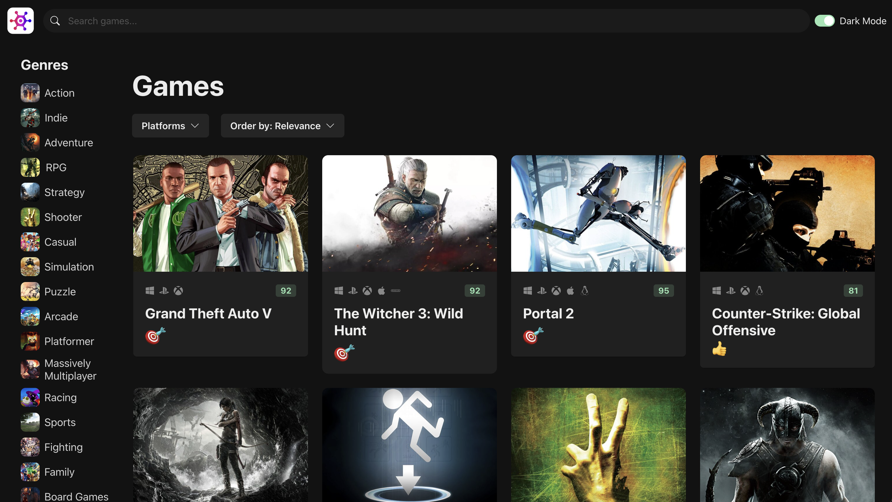
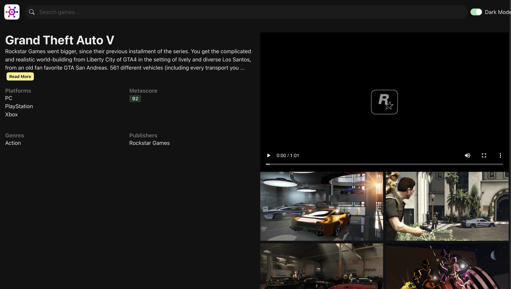

# Gamely 🎮


A modern, responsive game browser built with React and the [RAWG API](https://rawg.io/apidocs). Browse games by genre, platform, or popularity, and view game info with ease.

### 🔗 [Live Demo](https://gamely.tomfox.tech)

## Table of Contents

- [Features](#features)
- [Screenshots](#screenshots)
- [Built With](#built-with)
- [Setup](#setup)
- [Contributing](#contributing)
- [License](#license)

## Features ✨

- 🎮 Browse games by genre, platform, and search.
- 📊 Order games by relevance, popularity, release date, and more.
- 🔍 Infinite scrolling for seamless game discovery.
- 📝 Detailed view for each game to display additional information.
- 📱 Mobile-friendly, responsive design with dark mode support.
- ⏳ Dynamic skeleton loading for an improved user experience.

## Screenshots 📸


_Browse games by genre, platform, relevance, or search._


_View extra information about each game._

## Built With 📦

- [**React**](https://reactjs.org/): A JavaScript library for building user interfaces.
- [**Chakra-UI**](https://chakra-ui.com/): A modern React UI framework for building accessible and responsive components.
- [**React Query**](https://tanstack.com/query/latest): For efficient data fetching, and caching.
- [**React Router**](https://reactrouter.com/): For handling client-side routing and navigation.
- [**React Icons**](https://react-icons.github.io/react-icons/): A library of popular icons for React applications.
- [**Axios**](https://axios-http.com/): A promise-based HTTP client for making API requests.
- [**Zustand**](https://zustand-demo.pmnd.rs/): A lightweight state management library for managing global client state. Used with game filtering.
- [**React Infinite Scroll Component**](https://github.com/ankeetmaini/react-infinite-scroll-component): For implementing infinite scrolling functionality.
- [**ms**](https://github.com/vercel/ms): A utility for simple time calculations and formatting.

## Setup 🛠️

Follow these steps to set up the project locally:

### 1. Clone the Repository 🖥️

```bash
git clone https://github.com/Coookei/Gamely.git
cd Gamely
```

### 2. Install Dependencies 📦

Ensure that Node.js is installed. Then run:

```bash
npm install
```

### 3. Get an API Key 🔑

Create a free account and get an API key from [RAWG API](https://rawg.io/apidocs).

### 4. Add Environment Variables ⚙️

Create a `.env` file in the root directory and add the following variables:

```env
VITE_API_URL=https://api.rawg.io/api/
VITE_API_KEY=your_api_key_here
```

### 5. Start the server 🚀

Run the following command to start the app:

```bash
npm run dev
```

The app will be available at the URL shown in the console, normally `http://localhost:5173` on localhost.

## Contributing 🤝

Contributions, suggestions, and feedback are welcome!  
Feel free to fork the repo and submit a pull request.

1. Fork the project
2. Create a new branch (`git checkout -b feature/your-feature`)
3. Commit your changes (`git commit -m 'Add new feature'`)
4. Push to the branch (`git push origin feature/your-feature`)
5. Open a Pull Request

## License 📜

This project is licensed under the MIT License.
